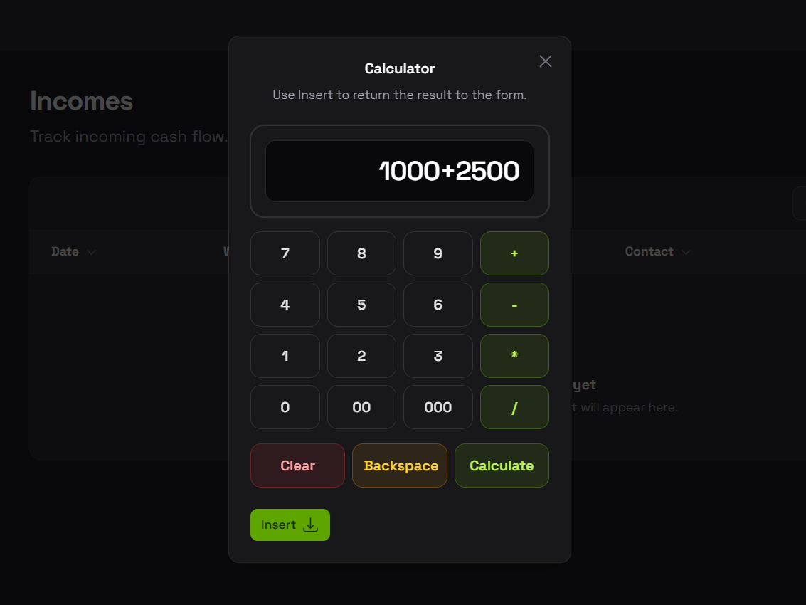

# Filament Calculator

[](https://packagist.org/packages/ariefng/filament-calculator)
[](https://github.com/ariefng/filament-calculator/actions?query=workflow%3Arun-tests+branch%3Amain)
[](https://github.com/ariefng/filament-calculator/actions?query=workflow%3A"Fix+PHP+code+styling"+branch%3Amain)
[](https://packagist.org/packages/ariefng/filament-calculator)


Provides a calculator modal action for Filament `TextInput` fields in panels and standalone forms.

Supports Filament v4 and v5.



## Installation

Install the package via Composer:

```bash
composer require ariefng/filament-calculator
```

Publish the package configuration:

```bash
php artisan vendor:publish --tag="filament-calculator-config"
```

Publish the package translations if you want to customize the labels:

```bash
php artisan vendor:publish --tag="filament-calculator-translations"
```

Currently, the package ships with translations for English (`en`) and Indonesian (`id`) only.

Register the package assets with Filament:

```bash
php artisan filament:assets
```

If you are using Filament Panels, you may also register the plugin in your panel provider:

```php
use Ariefng\FilamentCalculator\CalculatorPlugin;
use Filament\Panel;

public function panel(Panel $panel): Panel
{
    return $panel
        ->plugin(CalculatorPlugin::make());
}
```

## Usage

Attach the calculator action to a `TextInput` using `prefixAction()` or `suffixAction()`:

```php
use Ariefng\FilamentCalculator\Actions\CalculatorAction;
use Filament\Forms\Components\TextInput;

TextInput::make('amount')
    ->suffixAction(CalculatorAction::make());
```

```php
TextInput::make('amount')
    ->prefixAction(CalculatorAction::make());
```

## Configuration

The published config file looks like this:

```php
return [
    'max_digits' => 15,

    'action' => [
        'icon' => 'heroicon-o-calculator',
        'color' => 'gray',
        'modal_width' => 'sm',
    ],

    'insert_action' => [
        'color' => 'primary',
        'icon' => 'heroicon-o-arrow-down-tray',
        'icon_position' => 'after',
    ],
];
```

Available options:

- `max_digits`: maximum numeric digits allowed in the calculator.
- `action.icon`: calculator trigger icon. Default: `heroicon-o-calculator`.
- `action.color`: calculator trigger color. Default: `gray`.
- `action.modal_width`: modal width. Default: `sm`.
- `insert_action.color`: insert button color. Default: `primary`.
- `insert_action.icon`: insert button icon. Default: `heroicon-o-arrow-down-tray`.
- `insert_action.icon_position`: insert button icon position. Default: `after`.

Example:

```php
return [
    'max_digits' => 12,

    'action' => [
        'icon' => 'heroicon-o-bolt',
        'color' => 'success',
        'modal_width' => 'md',
    ],

    'insert_action' => [
        'color' => 'danger',
        'icon' => 'heroicon-o-arrow-left',
        'icon_position' => 'before',
    ],
];
```

## Styling

In an effort to align with Filament's theming methodology, you will need to use a custom theme to use this plugin.

> [!IMPORTANT]
> If you have not set up a custom theme and are using Filament Panels, follow the Filament styling documentation for your Filament version first.
>
> The following applies to both the Panels package and the standalone Forms package.

After setting up a custom theme, add the plugin's Blade source to your theme CSS file, or to your app CSS file if you are using the standalone Forms package:

```css
@source '../../../../vendor/ariefng/filament-calculator/resources/views/**/*';
```

The calculator stylesheet itself is registered through Filament's asset manager and lazy-loaded only when the calculator modal is rendered.

If you update this package locally during development, re-run:

```bash
php artisan filament:assets
php artisan optimize:clear
```

## Testing

```bash
composer test
```

## Contributing

Please see [CONTRIBUTING](.github/CONTRIBUTING.md) for details.

## Security Vulnerabilities

Please review [our security policy](.github/SECURITY.md) on how to report security vulnerabilities.

## Credits

- [Arief Nugraha](https://github.com/ariefng)
- [All Contributors](../../contributors)

## License

The MIT License (MIT). Please see [License File](LICENSE.md) for more information.
