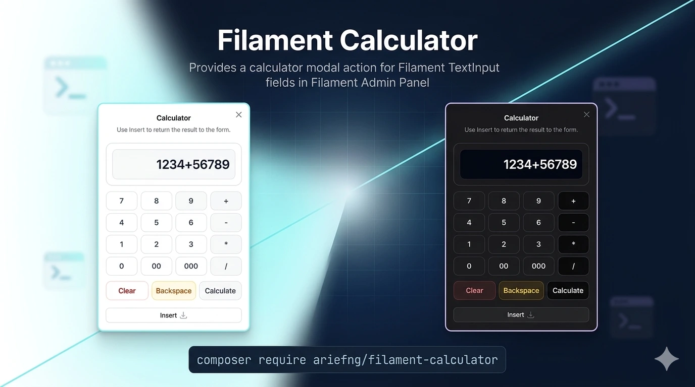

# Filament Calculator

[](https://packagist.org/packages/ariefng/filament-calculator)

Provides a calculator modal action for Filament `TextInput` fields in Filament Admin Panel.

> **Note:** Supports Filament **v4** and **v5**. For changes and updates, see the [CHANGELOG](CHANGELOG.md).



## Table of Contents

-   [Features](#features)
-   [Requirements](#requirements)
-   [Installation](#installation)
-   [Quick Start](#quick-start)
-   [Usage](#usage)
-   [Configuration](#configuration)
-   [Styling](#styling)
-   [Testing](#testing)
-   [Contributing](#contributing)
-   [Security Vulnerabilities](#security-vulnerabilities)
-   [Credits](#credits)
-   [License](#license)

## Features

-   🖼️ **Calculator Modal** - Full-featured calculator with basic arithmetic operations
-   🔧 **Flexible Attachment** - Attach as prefix or suffix action to any TextInput
-   ⚙️ **Configurable** - Customize icon, color, modal width, and more
-   🌐 **Multi-language** - Built-in translations for English and Indonesian
-   🔢 **Digit Limit** - Configurable maximum digits for input validation
-   ⚡ **Zero Configuration** - Works out of the box with sensible defaults
-   🎨 **Responsive** - Works seamlessly on desktop and mobile

## Requirements
-   Filament 4.0 or 5.0

## Installation

Install the package via Composer:

```bash
composer require ariefng/filament-calculator
```

Publish the package configuration (optional):

```bash
php artisan vendor:publish --tag="filament-calculator-config"
```

Publish the package translations (optional):

```bash
php artisan vendor:publish --tag="filament-calculator-translations"
```

Currently, the package ships with translations for English (`en`) and Indonesian (`id`) only.

If you are using Filament Panels, register the plugin in your panel provider:

```php
use Ariefng\FilamentCalculator\CalculatorPlugin;
use Filament\Panel;

public function panel(Panel $panel): Panel
{
    return $panel
        ->plugin(CalculatorPlugin::make());
}
```

## Quick Start

Register the plugin in your Filament panel, then attach the calculator action to your form field.

## Usage

Attach the calculator action to a `TextInput` using `prefixAction()` or `suffixAction()`:

```php
use Ariefng\FilamentCalculator\Actions\CalculatorAction;
use Filament\Forms\Components\TextInput;

TextInput::make('amount')
    ->suffixAction(CalculatorAction::make());

TextInput::make('amount')
    ->prefixAction(CalculatorAction::make());
```

Since `CalculatorAction` extends Filament's default `Action`, you can use any supported action customization methods on it. If you place the calculator inside another Filament modal or slide-over form, you may want the calculator modal to open on top of the parent modal instead of closing and reopening the parent. Filament documents this pattern here:

https://filamentphp.com/docs/5.x/actions/modals#overlaying-child-action-modals-on-top-of-parent-action-modals

Example:

```php
TextInput::make('amount')
    ->suffixAction(
        CalculatorAction::make()
            ->overlayParentActions()
    );
```

Example preview:


## Configuration

The published config file looks like this:

```php
return [
    'max_digits' => 15,

    'operator_buttons' => [
        'color' => 'gray',
    ],

    'action' => [
        'icon' => 'heroicon-o-calculator',
        'color' => 'gray',
        'modal_width' => 'sm',
    ],

    'insert_action' => [
        'color' => 'gray',
        'icon' => 'heroicon-o-arrow-down-tray',
        'icon_position' => 'after',
    ],
];
```

Available options:

- `max_digits`: maximum numeric digits allowed in the calculator.
- `operator_buttons.color`: color alias used by the `+`, `-`, `*`, `/`, and `=` buttons. Default: `gray`.
- `action.icon`: calculator trigger icon. Default: `heroicon-o-calculator`.
- `action.color`: calculator trigger color. Default: `gray`.
- `action.modal_width`: modal width. Default: `sm`.
- `insert_action.color`: insert button color. Default: `gray`.
- `insert_action.icon`: insert button icon. Default: `heroicon-o-arrow-down-tray`.
- `insert_action.icon_position`: insert button icon position. Default: `after`.

Example:

```php
return [
    'max_digits' => 12,

    'operator_buttons' => [
        'color' => 'warning',
    ],

    'action' => [
        'icon' => 'heroicon-o-bolt',
        'color' => 'success',
        'modal_width' => 'md',
    ],

    'insert_action' => [
        'color' => 'danger',
        'icon' => 'heroicon-o-arrow-left',
        'icon_position' => 'before',
    ],
];
```

## Styling

The calculator styles are automatically loaded globally - no need to run `php artisan filament:assets`.

If you need to customize the calculator's appearance, you can override the CSS by publishing the package's views and adding your custom styles to your application's CSS file.

The calculator modal uses Filament's built-in color variables. By default, the operator buttons and evaluate button use the `gray` color alias, and you can switch them to another Filament color alias through `operator_buttons.color`.

## Testing

```bash
composer test
```

## Contributing

Please see [CONTRIBUTING](.github/CONTRIBUTING.md) for details.

## Security Vulnerabilities

Please review [our security policy](.github/SECURITY.md) on how to report security vulnerabilities.

## Credits

- [Arief Nugraha](https://github.com/ariefng)
- [All Contributors](../../contributors)

This plugin was built entirely with Codex.

## License

The MIT License (MIT). Please see [License File](LICENSE.md) for more information.
